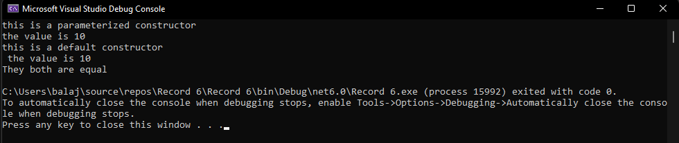

# Operator-Overloading

## Aim:
 To write a C# program to pass values through constructors(default and parameterized) and also overload equal operators by checking whether objects are equal using operator overloading. 
 
 ## Algorithm:
 ### Step 1:
Create a class for operator overloading.

### Step 2:
Get inputs for length,breadth from the user in overloading function.

### Step 3:
Compare the inputs such as length and breadth.

### Step 4:
Using equal to(==) and not equal to(!=) operator we can compare the inputs.

### Step 5:
Print the result.
 
 
 ## Program:
 ```
using System;

namespace OperOverload
{
    class Program
    {
        int n;
        public Program(int a)
        {
            this.n = a;
            Console.WriteLine("this is a parameterized constructor");
            Console.WriteLine("the value is " + this.n);
        }
        public Program()
        {
            this.n = 10;
            Console.WriteLine("this is a default constructor \n the value is " + this.n);
        }
        public static bool operator ==(Program p1, Program p2)
        {
            return p1.Equals(p2);
        }
        public static bool operator !=(Program p1, Program p2)
        {
            return !p1.Equals(p2);
        }
        static void Main(string[] args)
        {
            Program p1 = new Program(10);
            Program p4 = new Program();
            Program p2 = p4;

            if (p2 == p4)
            {
                Console.WriteLine("They both are equal");
            }
            else if (p1 != p4)
            {
                Console.WriteLine("They both are different ");
            }
        }
    }
}
 ```
 
 ## Output:
 
 
 ## Result:
Thus to write a C# program to pass values through constructors(default and parameterized) and also overload equal operators by checking whether objects are equal using operator overloading is successfully completed.